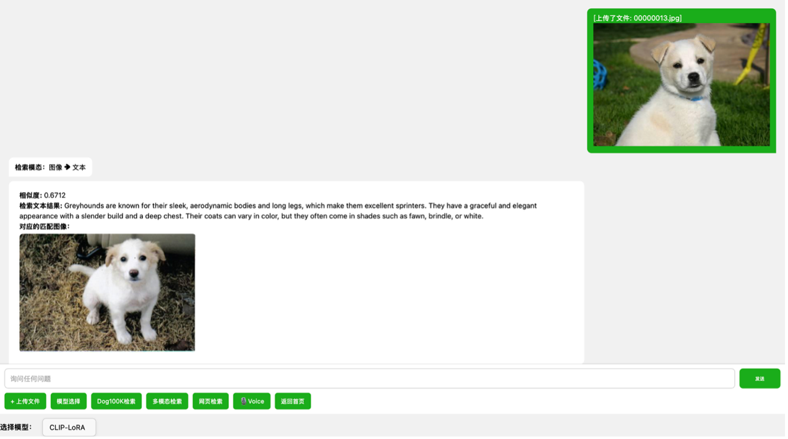
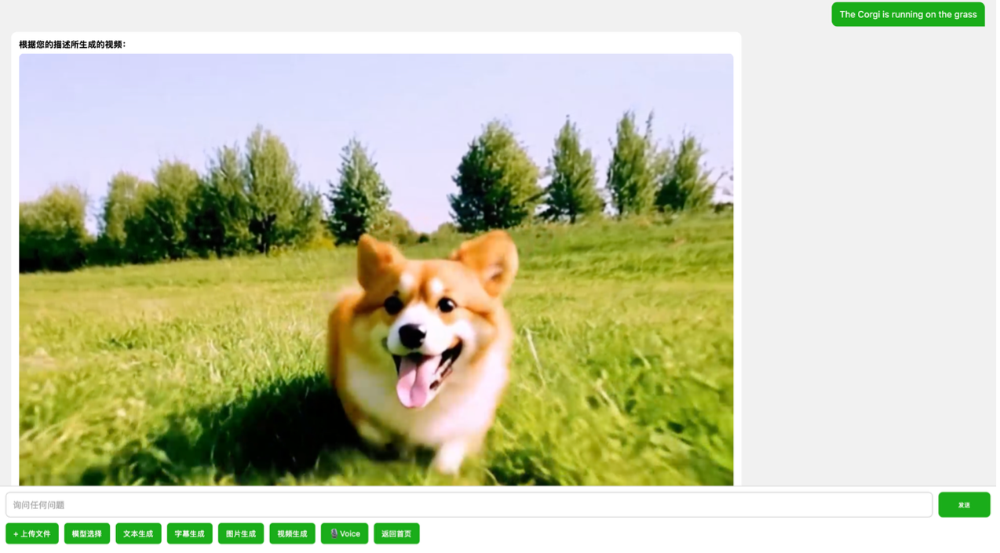
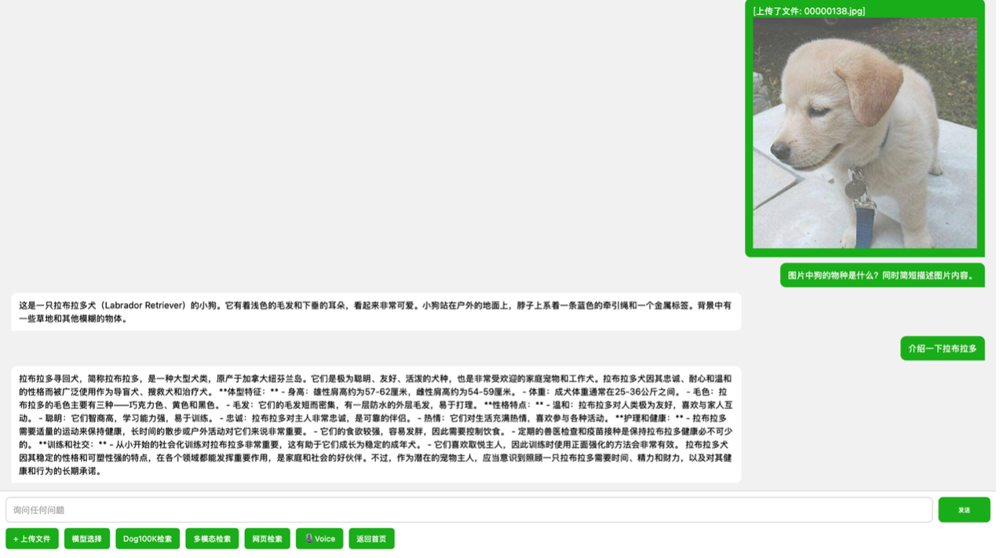
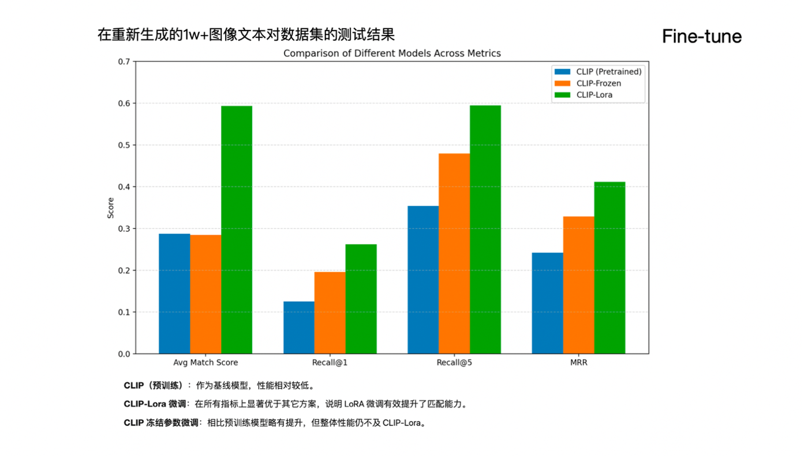
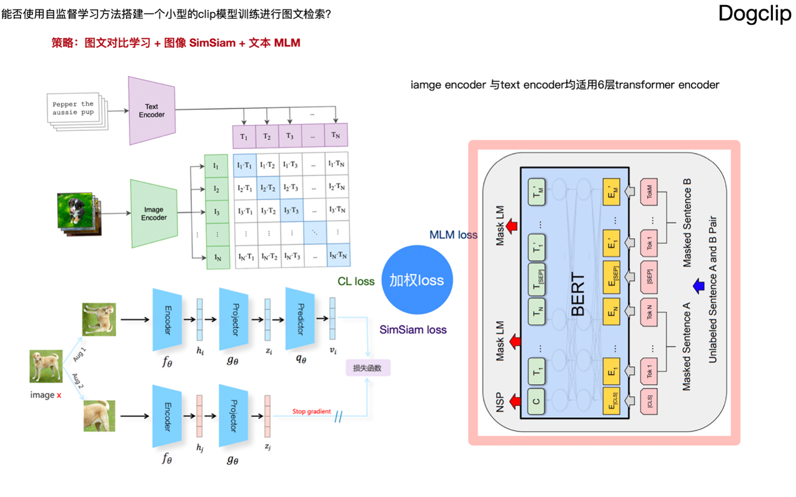

# 🐕 项目简介

**Dogretrieval** 是一个智能、交互式的狗狗多模态内容平台，支持图像与文本输入，完成检索、推理与生成等任务。项目设计理念为：

> **“理解与关爱并重”：借助 AI 理解狗狗，唤起人类关怀。**

<p align="center">
  
</p>

---

## 📦 核心数据集：Dog100K

我们构建了一个高质量的大规模狗狗图文数据集（全网最大） **Dog100K**，包含超过 **10 万** 对图像与文本对。

数据来源：
- **Tsinghua Dogs Dataset**
- **Stanford Dogs Dataset**
- 网络爬取 + 人工清洗数据

每条数据包括：
- 🖼️ 一张高清狗狗图像
- 📝 对应文本描述（外貌特征、性格习性等）

---


## 🎨 界面设计

- 借鉴 **微信官方设计规范** 进行界面布局与配色
- 使用 HTML + JavaScript 构建交互式前端
- 支持拖拽上传、响应式对话框、图文卡片显示
- UI 风格参考 **Tanrevel**、**CSSWinner** 等现代视觉产品

---


## 💡 功能概览

### 🧭 输入模式
- 图像输入：上传狗狗照片
- 文本输入：输入描述或提问

### 🔍 检索能力
- **图像 → 图像**：找出视觉上最相似的狗狗
- **图像 → 文本**：检索相关描述与品种信息
- **文本 → 文本**：找出语义最接近的描述文本
- **文本 → 图像**：检索符合描述的狗狗图片
<p align="center">
  
</p>


### 🌐 网络搜索
- 接入 **百度识图 API**，支持以图搜图
- 返回来自互联网上的相似狗狗图片（CSSWinner、微信视觉规范对齐）

### ✨ 生成能力
- **文本 → 图片**：调用 [CogView-3] 模型生成图像
- **文本 → 视频**：调用 [CogVideoX] 生成动画视频
- **图像 → 视频**：根据静态图像自动生成狗狗短视频

<p align="center">
  
</p>

### 💬 推理与对话
- 支持自然语言提问：“这是什么品种？”、“它适合家养吗？”
- 结合 [GLM-4] 与 [SentenceTransformer] 实现图文问答、语义推理

<p align="center">
  
</p>

---


## 🧠 CLIP 微调与自监督探索

我们探索了以下 CLIP 微调策略：

- 🔒 **冻结参数微调**：冻结 CLIP 的视觉与文本编码器前九层，仅微调高层表示，避免过拟合。
- ⚡ **LoRA（Low-Rank Adaptation）**：高效的参数微调方法，显著提升匹配性能。
- 🎯 在 1 万余条测试图文对上，评估指标包括：`相似度得分`、`Recall@1`、`Recall@5`、`MRR`，结果显示 **CLIP + LoRA 表现最佳**。
<p align="center">
  
</p>


我们还实现了一个 **轻量自监督 CLIP 原型**，用于小规模训练：

<p align="center">
  
</p>

---

## 🚀 快速开始

```bash
# 克隆项目
git clone https://github.com/choucisan/Dogretrieval.git
cd Dogretrieval

# 安装依赖
pip install -r requirements.txt

#数据集下载：
https://pan.quark.cn/s/847c986bb883
数据集放置DogUI/static目录下
IMAGE_DIR = "DogUI/static/data"
CAPTION_CSV = "DogUI/static/captions.csv"

#图片文本emd提前处理，检索更快
python encode_image.py 

SAVE_IMAGE_EMB = "DogUI/static/image_embeddings.npy"
SAVE_TEXT_EMB = "DogUI/static/image_captions.npy"

#智谱api设置
client = ZhipuAI(api_key="")
API_URL = ""
API_KEY = ""

# 运行服务
python DogUI/app.py

在浏览器中访问 http://localhost:5000 开始体验。

```
