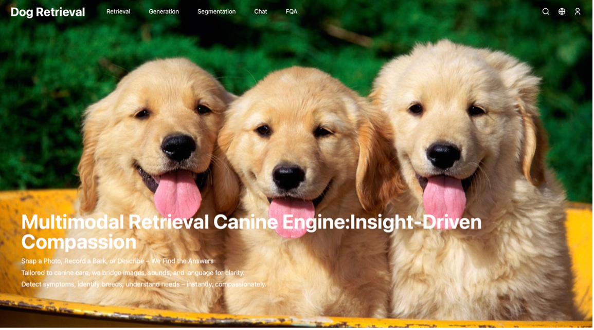

# Dogretrieval 🐶🔍
---

## 🐕 项目简介

**Dogretrieval** 是一个智能、交互式的狗狗多模态内容平台，支持图像与文本输入，完成检索、推理与生成等任务。项目设计理念为：

> **“理解与关爱并重”：借助 AI 理解狗狗，唤起人类关怀。**

<p align="center">
  
</p>


---

## 📦 核心数据集：Dog100K

我们构建了一个高质量的大规模狗狗图文数据集 **Dog100K**，包含超过 **10 万** 对图像与文本对。

数据来源：
- **Tsinghua Dogs Dataset**
- **Stanford Dogs Dataset**
- 网络爬取 + 人工清洗数据

每条数据包括：
- 🖼️ 一张高清狗狗图像
- 📝 对应文本描述（外貌特征、性格习性等）
- 🐾 狗种标注

---

## 🧠 CLIP 微调与自监督探索

我们探索了以下 CLIP 微调策略：

- 🔒 **冻结参数微调**：冻结 CLIP 的视觉与文本编码器前九层，仅微调高层表示，避免过拟合。
- ⚡ **LoRA（Low-Rank Adaptation）**：高效的参数微调方法，显著提升匹配性能。
- 🎯 在 1 万余条测试图文对上，评估指标包括：`相似度得分`、`Recall@1`、`Recall@5`、`MRR`，结果显示 **CLIP + LoRA 表现最佳**。

我们还实现了一个 **轻量自监督 CLIP 原型**，用于小规模训练：
- 图像编码器：`SimSiam`
- 文本编码器：6 层 Transformer + `Masked Language Modeling（MLM）`
- 损失函数：`InfoNCE` 对比损失

---

## 💡 功能概览

### 🧭 输入模式
- 图像输入：上传狗狗照片
- 文本输入：输入描述或提问

### 🔍 检索能力
- **图像 → 图像**：找出视觉上最相似的狗狗
- **图像 → 文本**：检索相关描述与品种信息
- **文本 → 文本**：找出语义最接近的描述文本
- **文本 → 图像**：检索符合描述的狗狗图片

### 🌐 网络搜索
- 接入 **百度识图 API**，支持以图搜图
- 返回来自互联网上的相似狗狗图片（CSSWinner、微信视觉规范对齐）

### ✨ 生成能力
- **文本 → 图片**：调用 [CogView-3] 模型生成图像
- **文本 → 视频**：调用 [CogVideoX] 生成动画视频
- **图像 → 视频**：根据静态图像自动生成狗狗短视频

### 💬 推理与对话
- 支持自然语言提问：“这是什么品种？”、“它适合家养吗？”
- 结合 [GLM-4] 与 [SentenceTransformer] 实现图文问答、语义推理

---

## 🎨 界面设计

- 借鉴 **微信官方设计规范** 进行界面布局与配色
- 使用 HTML + JavaScript 构建交互式前端
- 支持拖拽上传、响应式对话框、图文卡片显示
- UI 风格参考 **Tanrevel**、**CSSWinner** 等现代视觉产品

---

## 🔧 技术栈

- 多模态模型：`CLIP`、`LoRA`、`SimSiam`、`InfoNCE`
- 文本模型：`GLM-4`、`SentenceTransformer`
- 生成模型：`CogView-3`、`CogVideoX`
- 框架工具：`PyTorch`、`Flask`、`OpenCV`、`JavaScript`
- 网络功能：`百度识图 API`、爬虫反向图搜接口

---

## 📁 项目结构（部分）

Dogretrieval/
├── DogUI/                  # 前端界面（HTML + JS）
├── models/                 # CLIP 微调模型及权重
├── static/pre_data/       # 用户上传图片缓存
├── dataset/Dog100K/       # 核心图文数据集
├── retrieval/             # 检索逻辑
├── generation/            # 生成逻辑（文本转图像/视频）
├── app.py                 # Flask 后端服务
└── README.md              # 项目文档

---

## 🚀 快速开始

```bash
# 克隆项目
git clone https://github.com/yourusername/Dogretrieval.git
cd Dogretrieval

# 安装依赖
pip install -r requirements.txt

# 运行服务
python app.py

在浏览器中访问 http://localhost:5000 开始体验。

⸻

📌 后续工作计划
	•	多语言支持（中英混输检索）
	•	移动端适配与轻量部署
	•	狗狗表情识别与姿态识别扩展

⸻

📄 引用格式

如您在研究中使用该项目或 Dog100K 数据集，请引用：

@misc{dogretrieval2025,
  title={Dogretrieval: 基于CLIP微调的多模态狗狗检索与生成平台},
  author={Your Name},
  year={2025},
  url={https://github.com/yourusername/Dogretrieval}
}


⸻

❤️ 致谢
	•	OpenAI CLIP
	•	CogView-3
	•	CogVideoX
	•	Sentence Transformers
	•	GLM-4（智谱AI）
	•	百度识图 API
	•	微信官方设计指南
	•	[Tsinghua Dogs、Stanford Dogs Dataset]

---

如需我同时帮你生成英文版 README、部署手册、数据集文档、演示视频文案等，也可以告诉我。你可以把 `yourusername` 替换为你的 GitHub ID，或让我直接帮你修改。
